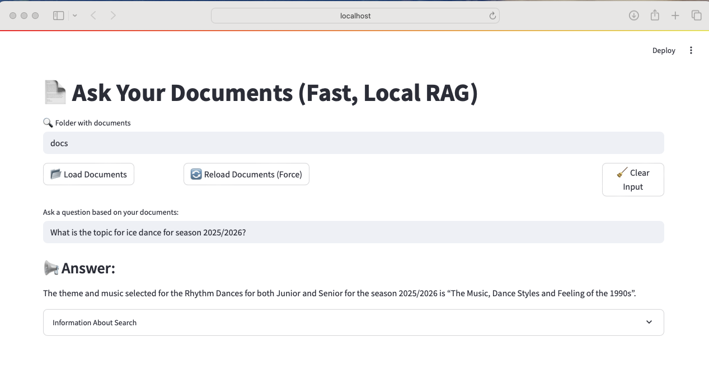
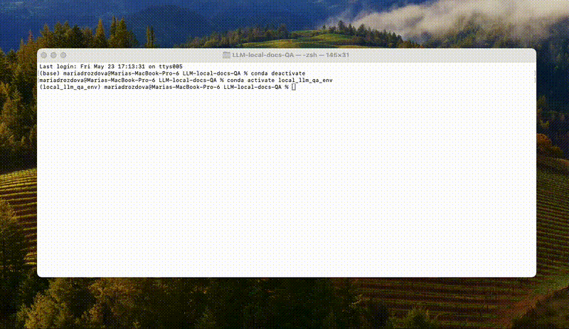

# 📄 Ask Your Documents (Fast, Local RAG)

A lightweight Streamlit app that lets you ask questions about your own `.pdf`, `.docx`, and `.txt` documents using a local Retrieval-Augmented Generation (RAG) setup.

> Inspired by the Coursera course [Generative AI with LLMs](https://www.coursera.org/learn/generative-ai-with-llms).  
> I created this app to apply the course concepts in a real-world mini-project.

---

## Demo





<details>
<summary>Click to expand instructions</summary>

1. Load your documents into the `docs/` folder  
2. Press "Load Documents"  
3. Ask a question — for example:  
   **"What is the theme for Ice Dance 2025–2026?"**

</details>

---

## 🚀 Quickstart

### 1. Clone the repository

```bash
git clone https://github.com/yourusername/LLM-search_docs.git
cd LLM-search_docs
```

### 2. Create and activate environment

```bash
conda create -n local_llm_qa_env python=3.10
conda activate local_llm_qa_env
```

### 3. Install dependencies

```bash
pip install -r requirements.txt
```

### 4. Add Hugging Face API keyvim

Create a `.env` file in the root:

```
HUGGINGFACEHUB_API_TOKEN=your_token_here
```

You can create your token [here](https://huggingface.co/settings/tokens).

### 5. Add your documents (or use the examples)

Put `.pdf`, `.docx`, or `.txt` files in the `docs/` folder.  
> **Included example**: International Skating Union (ISU) statements from their official (site)[https://www.isu.org/isu-communications/?tab=ISU%20Communications].

### 6. Run the app

```bash
streamlit run app.py
```

---

## Features

- Supports `.pdf`, `.docx`, `.txt` formats
- Automatically caches vector index (FAISS)
- LLM-based answering via Hugging Face Inference API
- Token estimation and chunk relevance scores

---

## Technologies

| Purpose              | Tool/Library               |
|----------------------|----------------------------|
| UI & Deployment      | Streamlit                  |
| LLM                  | `HuggingFaceH4/zephyr-7b-beta` |
| Embedding Model      | `sentence-transformers/all-MiniLM-L6-v2` |
| Vector Index         | FAISS                      |
| Document Loaders     | LangChain Community        |
| Environment Handling | `python-dotenv`            |

---

## Project Structure

```
LLM-search_docs/
├── app.py                  # Main app script
├── docs/                   # Example documents (ISU regulations)
├── requirements.txt        # Dependencies
└── .env                    # Hugging Face API token
```

---

## Background

After completing the Coursera course [Generative AI with LLMs](https://www.coursera.org/learn/generative-ai-with-llms),  
I wanted to build something useful and easy to share.  
This app lets me search my own documents with LLM support — now you can too.

---

## License

MIT — free to use, study, and adapt.
